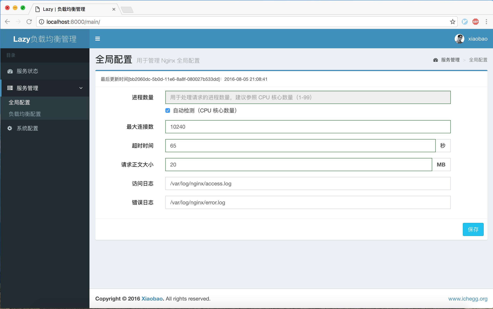
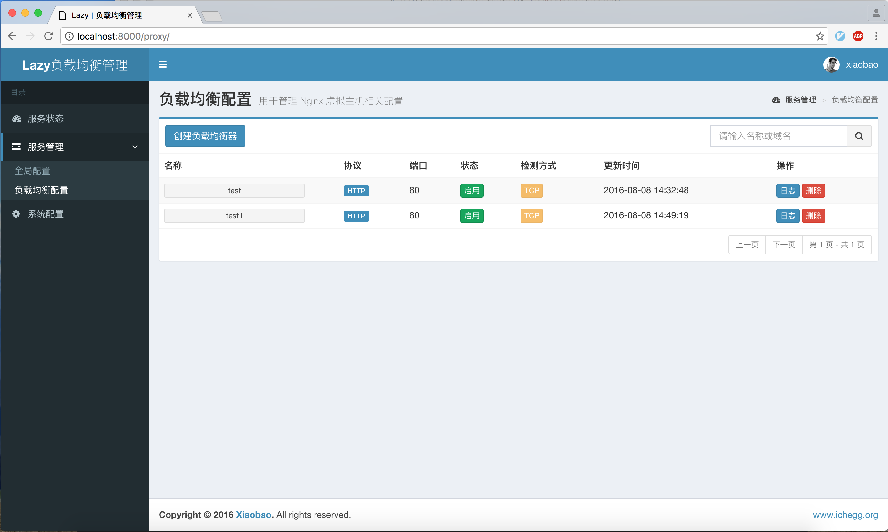
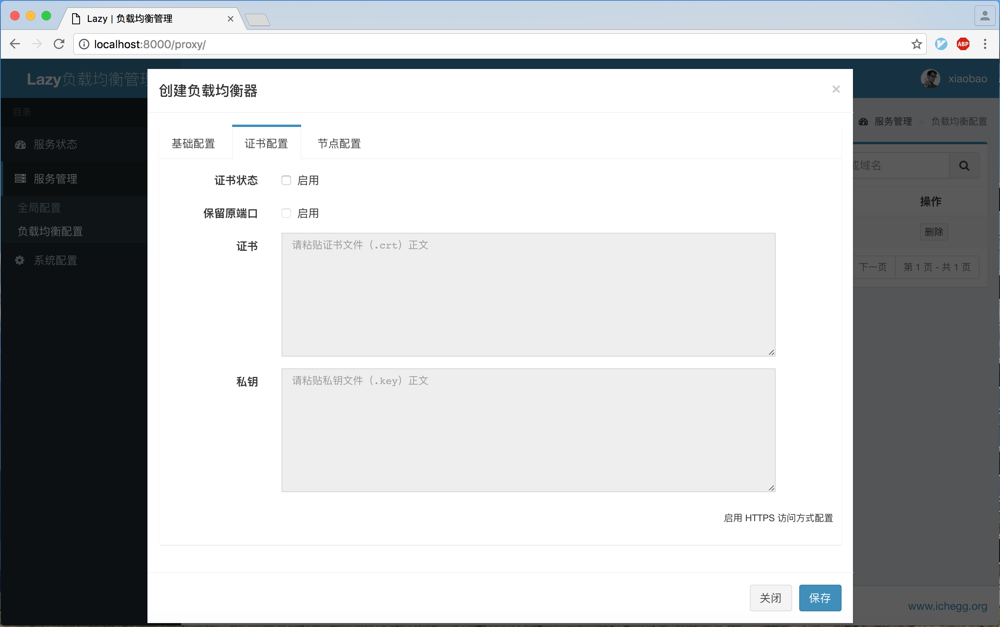
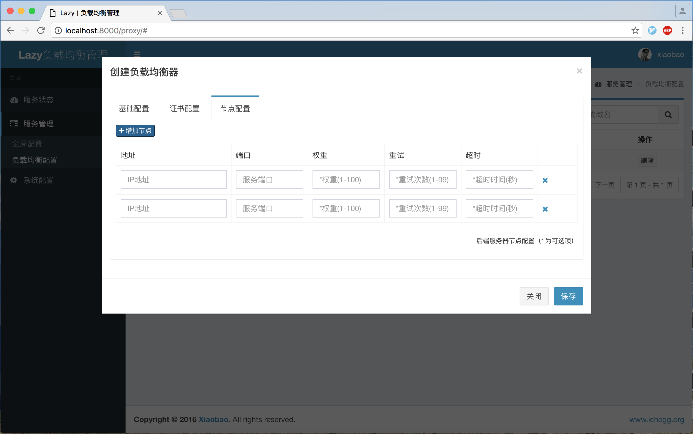
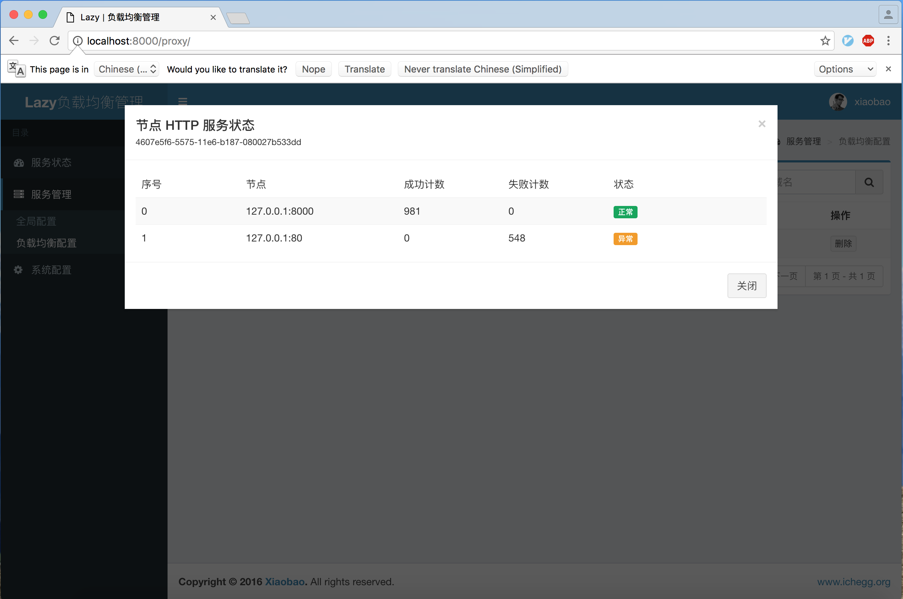
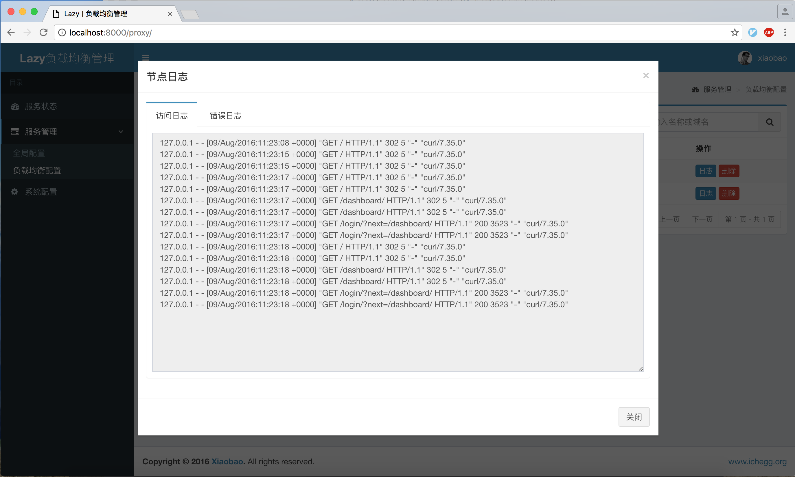

# Lazy-Balancer


项目起源于好哥们需要一个 7 层负载均衡器，无奈商业负载均衡器成本高昂，操作复杂。又没有特别喜欢（好看，好用）的开源产品，作为一名大 Ops 怎么能没有办法？正好最近在看 Django 框架，尝试自己给 Nginx 画皮，项目诞生！非专业开发，代码凑合看吧。

> 项目基于 [Django](https://www.djangoproject.com/) + [AdminLTE](https://www.almsaeedstudio.com/) 构建，在 Ubuntu 14.04 上测试通过；
>
> 因为增加了 iptables 自动控制，所以暂时不支持 docker 方式部署；需要本地测试的同学请使用 vagrant 方式
>
> 因为使用了 [nginx_upstream_check_module模块](http://tengine.taobao.org/document/http_upstream_check.html)，以及为了后续扩展方便，建议大家直接使用 [Tengine](http://tengine.taobao.org/) 替代 Nginx 服务

## 更新
* 将 Nginx 更换为 Tengine 以提供更灵活的功能支持以及性能提升
* 新增自定义管理员用户
* 新增 HTTP 状态码方式检测后端服务器，默认 TCP 方式
* 新增 HTTP 状态码方式支持查看后端服务器状态
* 更新 Vagrantfile
* 修复部分 Bug

## 运行
* 克隆代码
```
mkdir -p /app  
git clone https://github.com/v55448330/lazy-balancer.git /app/lazy_balancer  
```
* 卸载 nginx
```
apt-get -y purge nginx-*
apt-get -y autoremove
```
* 安装 tengine
```
git clone git://github.com/alibaba/tengine.git
apt-get install -y build-essential libssl-dev libpcre3 libpcre3-dev zlib1g-dev
cd tengine
./configure --user=www-data --group=www-data --prefix=/etc/nginx --sbin-path=/usr/sbin --error-log-path=/var/log/nginx/error.log --conf-path=/etc/nginx/nginx.conf --pid-path=/run/nginx.pid
make
make install
mkdir -p /etc/nginx/conf.d
echo "daemon off;" >> /etc/nginx/nginx.conf  
```
* 安装 supervisor
```
apt-get install supervisor  
update-rc.d supervisor enable  
```
* 配置 supervisor
```
cp -rf service/* /etc/supervisor/
```
* 安装依赖
```
apt-get install -y python-dev python-pip iptables
pip install -r requirements.txt  
```
* 初始化数据库
```
python manage.py makemigrations  
python manage.py migrate  
```
* 启动服务
```
service supervisor restart  
```
* 登录系统
```
http://[IP]:8000/  
```
> 首次登陆会要求创建管理员用户，如需修改，可在系统配置中重置管理员用户

## 功能
* Nginx 可视化配置
* Nginx 负载均衡（反向代理）配置
* Nginx 证书支持
* 系统状态监测
* 自动维护防火墙规则（白名单）

## 演示









